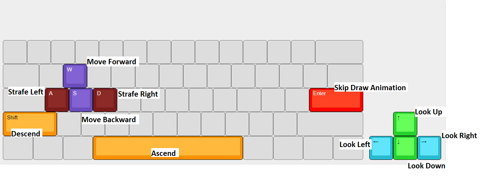
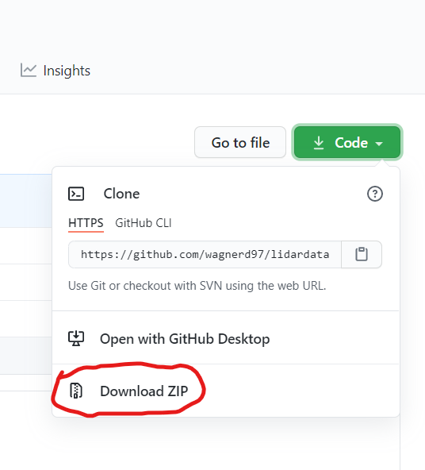
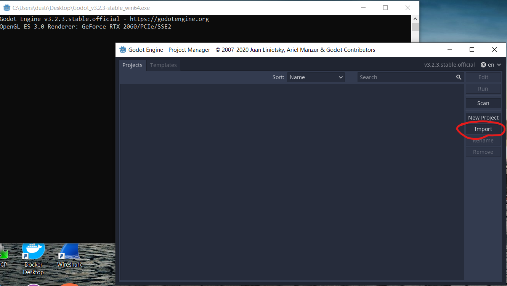
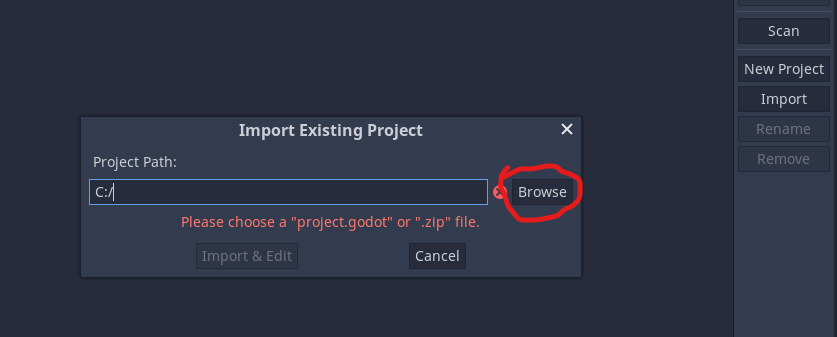
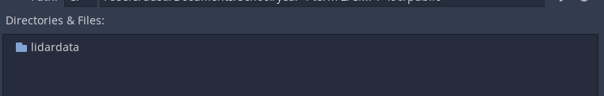
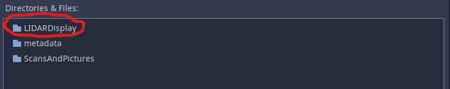
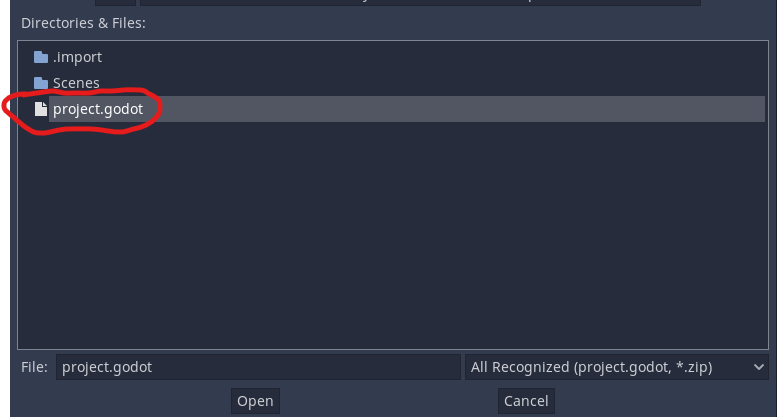
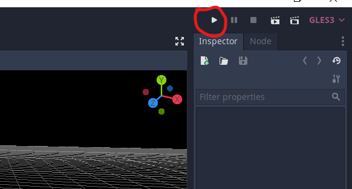
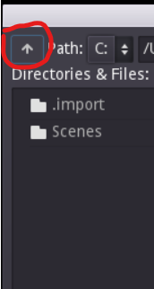
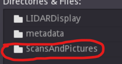

# Instructions
--------------------------------------------------------------------

# Controls

# Installation Instructions

Project is provided as source code for maximum compatibility
with all operating systems. The following instructions describe how to download
and use the software.

## Step 1

Download the standard version, 64 bit Godot game engine for your specific 
operating system from their website https://godotengine.org/download

The game engine is self contained and does not require installation

## Step 2

Download the ZIP file of the repository from this GitHub page

## Step 3

Un-ZIP the repository and note the location

## Step 4

Launch Godot
Note: on Mac OS the message "Can't be opened because it is from an
unidentified developer" may prevent the use of Godot

To bypass this follow these steps:
- Open your computer system preferences > Security & Privacy > Privacy
- Here you should see an option to "Allow Anyway" next to the Godot application

## Step 5

press the import button

## Step 6

press browse to open a file explorer

## Step 7

navigate to the lidardata folder we un-ZIPed in step 3

## Step 8

within the lidardata folder navigate into the LIDARDisplay folder

## Step 9

within the LIDARDisplay folder select and open the project.godot file

## Step 10

Press the "Import & Edit" button

## Step 11

The game engine should open. when it does you can launch the game by pressing
the play button in the top right corner of the screen

## Step 12

When the game loads, it will open a Godot file explorer. On Windows this file explorer
should open to the folder "ScansAndPictures". On Mac OS, The folder that opens may
be "LIDARDisplay". in this case navigate up

Then navigate into the "ScansAndPictures" folder

## Step 13

From this folder select any available .dat file and it will begin to be rendered in the
game window
